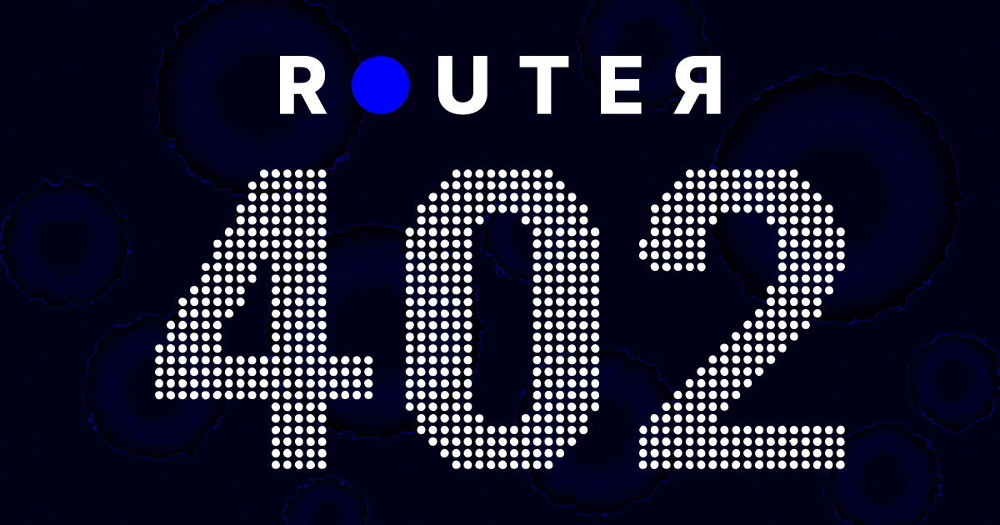
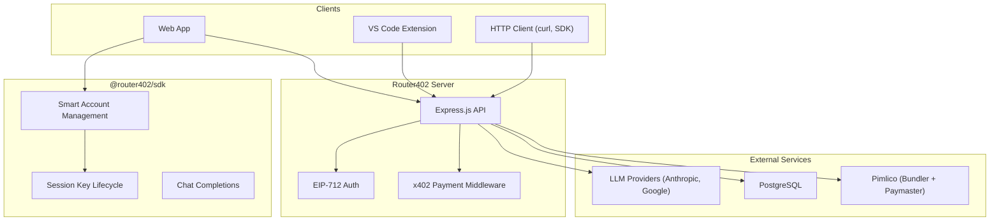

# Router402

Router402 is a payment-gated API platform that enables developers to access AI models using the [x402 HTTP payment protocol](https://www.x402.org/). It combines ERC-4337 smart accounts with session keys to provide a seamless, gasless payment experience for AI model inference.

## What is Router402?

Router402 provides:

- **Payment-Gated AI APIs** -- Access top AI models (Claude, Gemini) through a single API with automatic billing via on-chain payments.
- **Smart Account Abstraction** -- Users interact through Kernel v3.1 smart accounts powered by ZeroDev, with gas fees sponsored by Pimlico.
- **Session Keys** -- Delegated signing keys that allow your backend to execute transactions on behalf of users without holding their private keys.
- **OpenAI-Compatible Chat API** -- A drop-in replacement for OpenAI-style chat completion endpoints, with built-in usage tracking and billing.

## Architecture Overview

## Supported Models

| Model | Provider | Input Price | Output Price |
|-------|----------|-------------|--------------|
| `anthropic/claude-opus-4.6` | Anthropic | $5.00/M | $25.00/M |
| `anthropic/claude-opus-4.5` | Anthropic | $5.00/M | $25.00/M |
| `anthropic/claude-sonnet-4.5` | Anthropic | $3.00/M | $15.00/M |
| `anthropic/claude-haiku-4.5` | Anthropic | $1.00/M | $5.00/M |
| `google/gemini-3-pro-preview` | Google | $4.00/M | $18.00/M |
| `google/gemini-3-flash-preview` | Google | $0.50/M | $3.00/M |

*Prices are per million tokens. A 10% commission is applied on top of base costs.*

## Quick Links

| Section | Description |
|---------|-------------|
| [API Reference](api-reference/) | REST API endpoints -- authorize, models, and chat completions |
| [SDK Guide](sdk/) | Installation, setup, and usage examples |
| [Architecture](guides/architecture.md) | System design, data flows, and technology stack |
| [Setup Flow](guides/setup-flow.md) | Complete user onboarding walkthrough |
