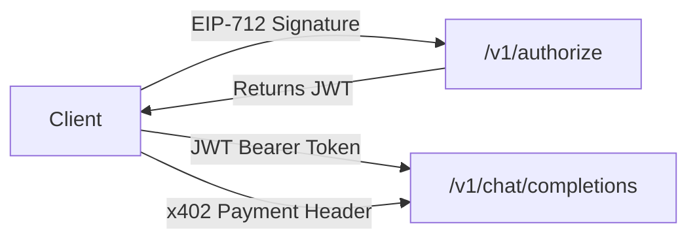

# API Reference

The Router402 API provides access to AI model inference through a payment-gated REST API. All endpoints follow a consistent response format and use Zod for request validation.

## Base URL

```
https://api.router402.xyz
```

## Endpoints

| Method | Path | Auth | Description |
|--------|------|------|-------------|
| `POST` | [`/v1/authorize`](authentication.md#authorize-session-key) | EIP-712 Signature | Authorize a session key and receive a JWT token |
| `GET` | [`/v1/models`](models.md) | None | List supported AI models |
| `POST` | [`/v1/chat/completions`](chat-completions.md) | JWT / x402 Payment | Chat completion (streaming & non-streaming) |
| `GET` | `/health` | None | Server health check |

## Response Format

All responses follow the `ApiResponse<T>` wrapper:

**Success:**

```json
{
  "data": { ... },
  "error": null,
  "meta": {
    "timestamp": "2026-01-30T10:30:00.000Z",
    "path": "/v1/models"
  }
}
```

**Error:**

```json
{
  "data": null,
  "error": "Invalid wallet address format",
  "meta": {
    "timestamp": "2026-01-30T10:30:00.000Z",
    "path": "/v1/authorize"
  }
}
```

## Authentication Methods

Router402 uses multiple authentication mechanisms depending on the endpoint:



### EIP-712 Signature
The `/v1/authorize` endpoint requires an EIP-712 typed data signature to verify wallet ownership. The signature is passed in the `x-authorization-signature` header.

### JWT Token
After successful authorization, clients receive a JWT token. Pass it as `Authorization: Bearer <token>` to access protected endpoints without payment.

### x402 Payment Protocol
The chat completions endpoint is also accessible via the x402 payment protocol. If no JWT is provided, the server responds with HTTP `402 Payment Required` along with payment requirements.

## Error Codes

| HTTP Status | Meaning |
|-------------|---------|
| `200` | Success |
| `201` | Resource created |
| `400` | Bad request (validation error) |
| `401` | Unauthorized (invalid signature or token) |
| `402` | Payment required (x402) |
| `429` | Rate limited |
| `500` | Internal server error |

## Rate Limiting

When rate limited, the server returns HTTP `429` with these headers:

| Header | Description |
|--------|-------------|
| `X-RateLimit-Limit` | Maximum requests allowed |
| `X-RateLimit-Remaining` | Remaining requests in window |
| `X-RateLimit-Reset` | Unix timestamp when limit resets |
| `Retry-After` | Seconds to wait before retrying |
