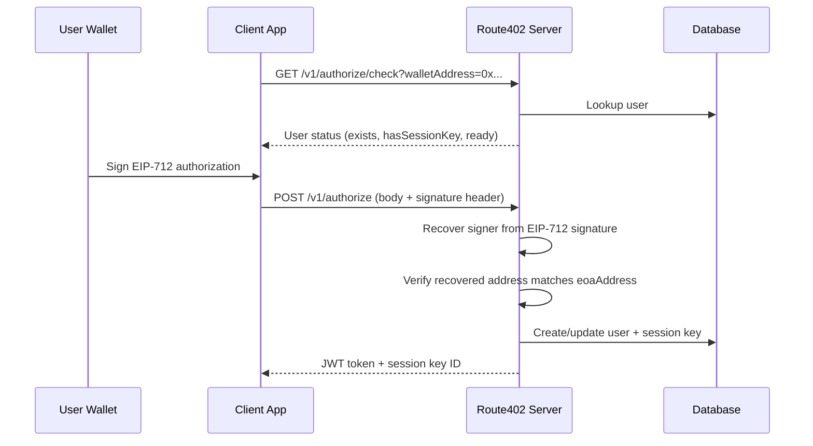

# Authorization

The authorization endpoints handle user registration, session key management, and JWT token generation using EIP-712 signature verification.

## Authorization Flow



---

## Check User Status

Check whether a wallet address is registered and fully configured.

**`GET /v1/authorize/check`**

### Query Parameters

| Parameter | Type | Required | Description |
|-----------|------|----------|-------------|
| `walletAddress` | `string` | Yes | Ethereum address (`0x`-prefixed) |

### Example Request

```bash
curl "https://api.router402.xyz/v1/authorize/check?walletAddress=0x1234567890abcdef1234567890abcdef12345678"
```

### Response (200 OK)

```json
{
  "data": {
    "exists": true,
    "hasSessionKey": true,
    "fieldsComplete": true,
    "ready": true,
    "user": {
      "walletAddress": "0x1234567890abcdef1234567890abcdef12345678",
      "hasPaymentThreshold": true,
      "currentDebt": "0.00",
      "totalSpent": "1.25"
    },
    "sessionKey": {
      "chainId": 8453,
      "smartAccountAddress": "0xabcdef...",
      "createdAt": "2026-01-30T10:00:00.000Z"
    }
  },
  "error": null,
  "meta": {
    "timestamp": "2026-01-30T10:30:00.000Z",
    "path": "/v1/authorize/check"
  }
}
```

### Response Fields

| Field | Type | Description |
|-------|------|-------------|
| `exists` | `boolean` | Whether the user exists in the database |
| `hasSessionKey` | `boolean` | Whether a session key is registered |
| `fieldsComplete` | `boolean` | Whether all required fields are set |
| `ready` | `boolean` | `true` when user is fully configured and can use the API |
| `user` | `object?` | User details (only present if user exists) |
| `user.hasPaymentThreshold` | `boolean` | Whether the user has a configured payment threshold |
| `user.currentDebt` | `string` | Current accumulated debt as a decimal string |
| `user.totalSpent` | `string` | Total amount spent as a decimal string |
| `sessionKey` | `object?` | Session key details (only present if registered) |
| `sessionKey.chainId` | `number` | Blockchain network ID |
| `sessionKey.smartAccountAddress` | `string` | Associated smart account address |
| `sessionKey.createdAt` | `string` | ISO 8601 timestamp |

---

## Authorize Session Key

Submit a session key for authorization with EIP-712 signature verification. Returns a JWT token for authenticated API access.

**`POST /v1/authorize`**

### Headers

| Header | Required | Description |
|--------|----------|-------------|
| `Content-Type` | Yes | `application/json` |
| `x-authorization-signature` | Yes | EIP-712 signature of the authorization message |

### Request Body

| Field | Type | Required | Description |
|-------|------|----------|-------------|
| `smartAccountAddress` | `string` | Yes | Smart account address (`0x`-prefixed) |
| `privateKey` | `string` | Yes | Session key private key |
| `serializedSessionKey` | `string` | Yes | Serialized session key permission data |
| `eoaAddress` | `string` | Yes | Owner EOA wallet address (`0x`-prefixed) |
| `chainId` | `number` | Yes | Blockchain network ID (positive integer) |
| `nonce` | `number` | Yes | Replay protection nonce (non-negative integer) |

### EIP-712 Signature Details

The authorization message must be signed using EIP-712 typed data with the following structure:

**Domain:**

```typescript
{
  name: "Router402 Authorization",
  version: "1",
  chainId: <chainId from request>
}
```

**Types:**

```typescript
{
  Authorization: [
    { name: "smartAccountAddress", type: "address" },
    { name: "privateKey", type: "string" },
    { name: "serializedSessionKey", type: "string" },
    { name: "eoaAddress", type: "address" },
    { name: "chainId", type: "uint256" },
    { name: "nonce", type: "uint256" }
  ]
}
```

The signature must be produced by the EOA that owns the smart account. The server recovers the signer address and verifies it matches `eoaAddress`.

### Example Request

```bash
curl -X POST "https://api.router402.xyz/v1/authorize" \
  -H "Content-Type: application/json" \
  -H "x-authorization-signature: 0xabcdef..." \
  -d '{
    "smartAccountAddress": "0xabcdef...",
    "privateKey": "0x...",
    "serializedSessionKey": "...",
    "eoaAddress": "0x123456...",
    "chainId": 8453,
    "nonce": 0
  }'
```

### Response (201 Created)

```json
{
  "data": {
    "token": "eyJhbGciOiJIUzI1NiIsInR5cCI6IkpXVCJ9...",
    "sessionKeyId": "sk_abc123"
  },
  "error": null,
  "meta": {
    "timestamp": "2026-01-30T10:30:00.000Z",
    "path": "/v1/authorize"
  }
}
```

### Error Responses

| Status | Condition |
|--------|-----------|
| `400` | Missing `x-authorization-signature` header or request body validation failed |
| `401` | Invalid EIP-712 signature (recovered address doesn't match `eoaAddress`) |
| `500` | Internal server error |
