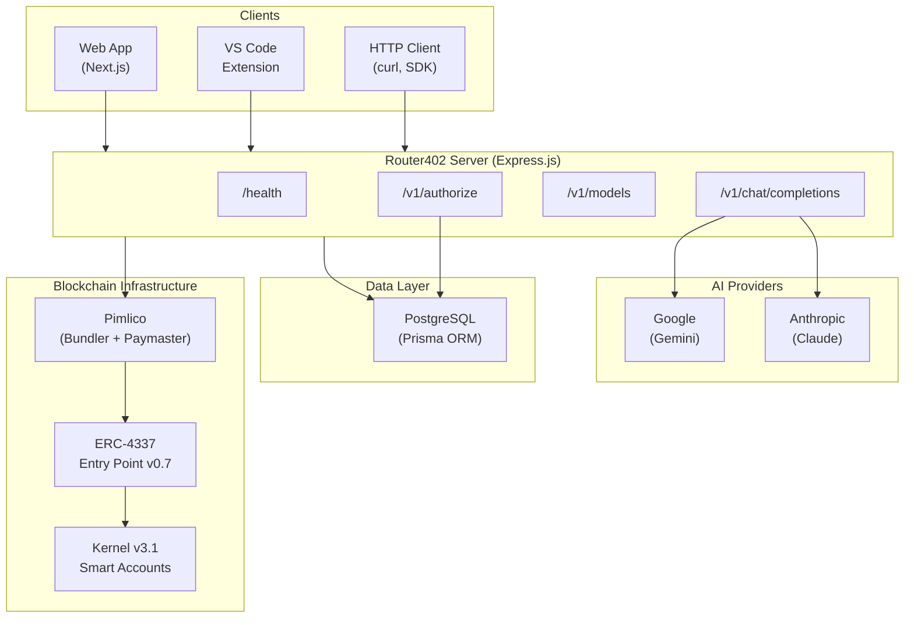
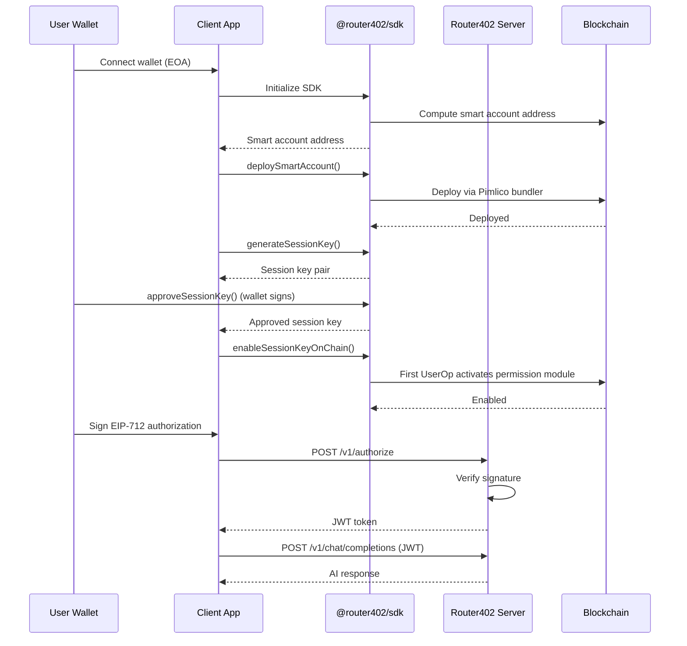
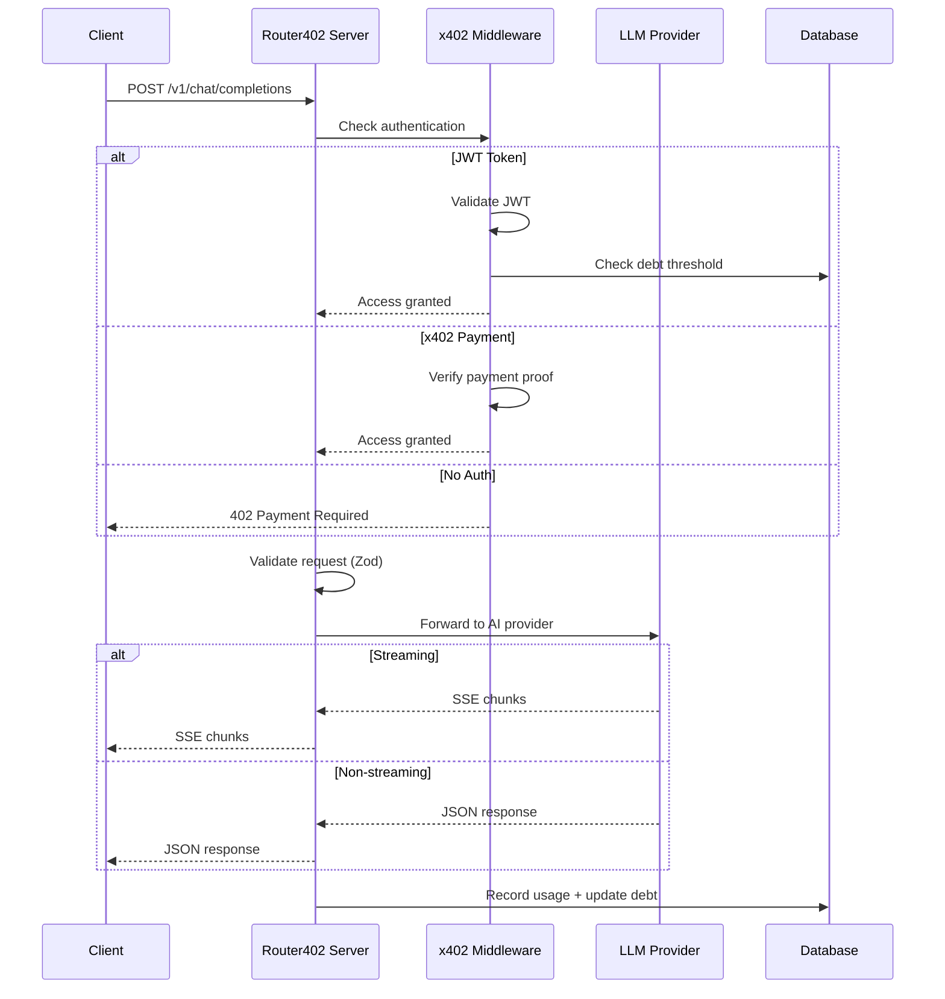
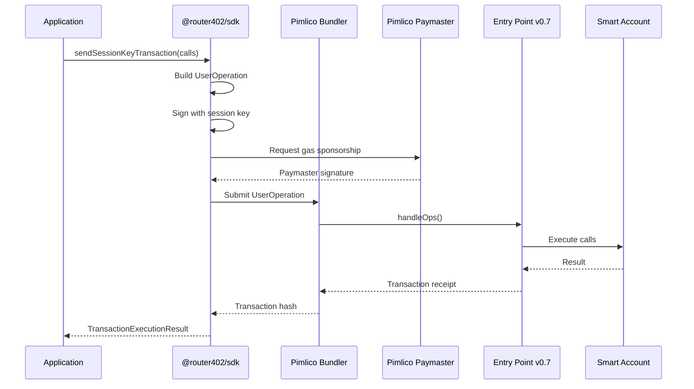
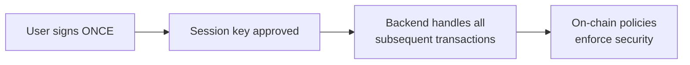

# Architecture

This guide explains the technical architecture of Router402, how its components interact, and the key design decisions behind the system.

## System Overview

Router402 is a monorepo containing multiple applications and shared packages:

```
hackmoney-router402/
├── apps/
│   ├── server/           # Express.js API server
│   ├── web/              # Next.js frontend
│   ├── extension/        # VS Code browser extension
│   ├── facilitator/      # Payment facilitator service
│   ├── contracts/        # Smart contracts
│   └── mcp/              # Model Context Protocol server
├── packages/
│   ├── sdk/              # @router402/sdk -- Core SDK
│   ├── types/            # @router402/types -- Shared type definitions
│   └── utils/            # @router402/utils -- Shared utilities
```

## Component Architecture



## Technology Stack

### Backend

| Component | Technology | Purpose |
|-----------|-----------|---------|
| Web Framework | Express.js | HTTP server and routing |
| Database | PostgreSQL + Prisma | User data, session keys, usage tracking |
| Validation | Zod | Request/response schema validation |
| Security | Helmet, CORS | HTTP security headers and cross-origin policies |
| Auth | JWT + EIP-712 | Session tokens and signature verification |

### Frontend

| Component | Technology | Purpose |
|-----------|-----------|---------|
| Framework | Next.js 16 | React-based web application |
| Wallet Connection | Wagmi + ConnectKit | Web3 wallet integration |
| State Management | Zustand | Client-side state |
| Styling | TailwindCSS 4 | Utility-first CSS |

### Blockchain

| Component | Technology | Purpose |
|-----------|-----------|---------|
| Smart Accounts | ZeroDev Kernel v3.1 | ERC-4337 smart contract wallets |
| Account Abstraction | ERC-4337 (Entry Point v0.7) | User operation standard |
| Bundler/Paymaster | Pimlico | Transaction bundling and gas sponsorship |
| Chain Interaction | Viem | TypeScript Ethereum client |

### Monorepo

| Component | Technology | Purpose |
|-----------|-----------|---------|
| Build System | Turborepo v2.8 | Monorepo build orchestration |
| Package Manager | Bun 1.3 | Fast JS runtime and package manager |
| Linting/Formatting | Biome | Code quality and formatting |

## Data Flows

### Authentication Flow



### Chat Completion Flow



### Transaction Execution Flow



## Key Design Decisions

### Why ERC-4337?

ERC-4337 (Account Abstraction) provides several advantages:

- **Gas sponsorship** -- Users don't need to hold ETH. The Pimlico paymaster covers gas fees.
- **Batched transactions** -- Multiple calls in a single transaction.
- **Programmable validation** -- Session keys with on-chain policy enforcement.
- **Deterministic addresses** -- Smart account addresses are computable before deployment.

### Why Session Keys?

Session keys solve a critical UX problem: requiring wallet signatures for every API call would make the system unusable.



1. The user signs **once** to approve a session key.
2. The session key handles all subsequent transactions automatically.
3. On-chain policies (timestamp, caller restrictions) ensure security.
4. The backend can execute transactions without the user's private key.

### Why x402?

The x402 HTTP payment protocol provides a standardized way to monetize APIs:

- Follows HTTP semantics (402 Payment Required).
- Payment proof is included in HTTP headers.
- Works with any HTTP client.
- Supports multiple payment networks and tokens.

### Why Pimlico?

Pimlico provides the infrastructure layer for ERC-4337:

- **Bundler** -- Collects user operations and submits them as transactions.
- **Paymaster** -- Sponsors gas fees so users can transact without ETH.
- **Gas estimation** -- Accurate gas pricing for user operations.

## Security Model

### Signature Verification

- Authorization uses EIP-712 typed data signatures -- resistant to replay attacks via nonces and domain separation.
- The server recovers the signer address and verifies it matches the expected wallet.

### Session Key Security

- Session keys have on-chain expiration enforced by the smart contract.
- `allowedCallers` policy restricts which addresses can submit transactions.
- Session key private keys are never stored on-chain.
- Keys can be scoped to specific operations via custom policies.

### API Security

- All endpoints use Helmet for security headers.
- CORS is configured to allow only specified origins.
- Request bodies are validated with Zod schemas.
- JWT tokens have configurable expiration.
