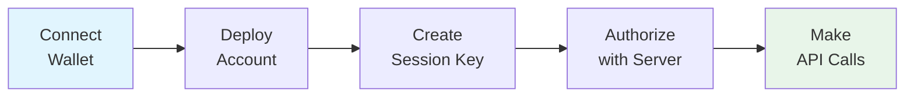
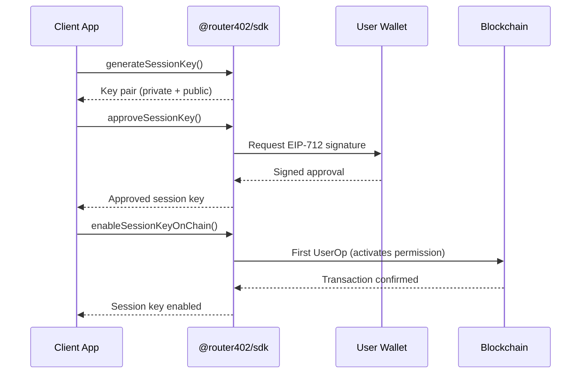

# Setup Flow

This guide walks through the complete user onboarding flow, from wallet connection to making the first authenticated API call.

## Overview



## Phase 1: Connect Wallet

The user connects their EOA wallet (MetaMask, WalletConnect, etc.) to the application.

```typescript
// Using Wagmi + ConnectKit in React
import { ConnectKitButton } from "connectkit";
import { useAccount, useWalletClient } from "wagmi";

function App() {
  const { address, isConnected } = useAccount();
  const { data: walletClient } = useWalletClient();

  return (
    <div>
      <ConnectKitButton />
      {isConnected && <p>Connected: {address}</p>}
    </div>
  );
}
```

## Phase 2: Initialize SDK and Deploy Smart Account

```typescript
import { Router402Sdk } from "@router402/sdk";
import { baseSepolia } from "viem/chains";

const sdk = new Router402Sdk({
  chain: baseSepolia,
  pimlicoApiKey: process.env.NEXT_PUBLIC_PIMLICO_API_KEY!,
});

async function initializeAccount(walletClient, eoaAddress) {
  const info = await sdk.getSmartAccountInfo(walletClient, eoaAddress);
  console.log("Smart Account:", info.address);
  console.log("Deployed:", info.isDeployed);

  if (!info.isDeployed) {
    const deployResult = await sdk.deploySmartAccount(walletClient);
    if (!deployResult.success) {
      throw new Error("Deployment failed: " + deployResult.error);
    }
    console.log("Deployed! TX:", deployResult.txHash);
  }

  return info;
}
```

## Phase 3: Create and Approve Session Key



```typescript
async function createSessionKey(walletClient, smartAccountAddress, eoaAddress) {
  // Generate a random keypair
  const sessionKey = sdk.generateSessionKey(smartAccountAddress, eoaAddress);

  // Owner approves (wallet will prompt for signature)
  const approvedKey = await sdk.approveSessionKey(walletClient, sessionKey);

  // Enable on-chain (first session key transaction)
  const USDC_ADDRESS = "0x036CbD53842c5426634e7929541eC2318f3dCF7e"; // Base Sepolia
  await sdk.enableSessionKeyOnChain(approvedKey, USDC_ADDRESS, smartAccountAddress);

  return approvedKey;
}
```

## Phase 4: Authorize with Server

Send the session key data to the Route402 server to receive a JWT token.

```typescript
import { signTypedData } from "viem/actions";

async function authorizeWithServer(walletClient, sessionKey, smartAccountAddress, eoaAddress, chainId) {
  const backendData = sdk.exportSessionKeyForBackend(sessionKey);
  const nonce = 0;

  const requestBody = {
    smartAccountAddress,
    privateKey: backendData.privateKey,
    serializedSessionKey: backendData.serializedSessionKey,
    eoaAddress,
    chainId,
    nonce,
  };

  // Sign EIP-712 authorization message
  const signature = await signTypedData(walletClient, {
    domain: {
      name: "Router402 Authorization",
      version: "1",
      chainId: BigInt(chainId),
    },
    types: {
      Authorization: [
        { name: "smartAccountAddress", type: "address" },
        { name: "privateKey", type: "string" },
        { name: "serializedSessionKey", type: "string" },
        { name: "eoaAddress", type: "address" },
        { name: "chainId", type: "uint256" },
        { name: "nonce", type: "uint256" },
      ],
    },
    primaryType: "Authorization",
    message: {
      smartAccountAddress,
      privateKey: backendData.privateKey,
      serializedSessionKey: backendData.serializedSessionKey,
      eoaAddress,
      chainId: BigInt(chainId),
      nonce: BigInt(nonce),
    },
  });

  const response = await fetch("https://api.router402.xyz/v1/authorize", {
    method: "POST",
    headers: {
      "Content-Type": "application/json",
      "x-authorization-signature": signature,
    },
    body: JSON.stringify(requestBody),
  });

  const result = await response.json();
  return result.data; // { token, sessionKeyId }
}
```

## Phase 5: Make Authenticated API Calls

Use the JWT token for chat completions.

```typescript
async function chat(token, message) {
  const response = await fetch("https://api.router402.xyz/v1/chat/completions", {
    method: "POST",
    headers: {
      "Content-Type": "application/json",
      "Authorization": `Bearer ${token}`,
    },
    body: JSON.stringify({
      model: "anthropic/claude-sonnet-4.5",
      messages: [
        { role: "user", content: message },
      ],
    }),
  });

  const result = await response.json();
  return result.choices[0].message.content;
}

const answer = await chat(token, "What is account abstraction?");
console.log(answer);
```

## Using setupAccount (Simplified)

The SDK provides `setupAccount()` to handle phases 2-3 in a single call:

```typescript
const result = await sdk.setupAccount(walletClient, eoaAddress, {
  usdcAddress: "0x036CbD53842c5426634e7929541eC2318f3dCF7e",
  onStatus: (status) => {
    switch (status) {
      case "initializing":
        console.log("Getting account info...");
        break;
      case "deploying":
        console.log("Deploying smart account...");
        break;
      case "creating_session_key":
        console.log("Generating session key...");
        break;
      case "approving_session_key":
        console.log("Please sign in your wallet...");
        break;
      case "enabling_session_key":
        console.log("Enabling session key on-chain...");
        break;
      case "complete":
        console.log("Setup complete!");
        break;
    }
  },
});

// Then proceed to Phase 4 (authorize) and Phase 5 (API calls)
```

## Checking Existing Status

Before running the full setup, check if the user is already configured:

```typescript
const response = await fetch(
  `https://api.router402.xyz/v1/authorize/check?walletAddress=${eoaAddress}`
);
const status = await response.json();

if (status.data.ready) {
  console.log("User is already set up!");
  // Skip to making API calls
} else {
  console.log("Needs setup:", {
    exists: status.data.exists,
    hasSessionKey: status.data.hasSessionKey,
  });
  // Run the setup flow
}
```

## Error Handling

```typescript
import { SmartAccountError } from "@router402/sdk";

try {
  await sdk.setupAccount(walletClient, eoaAddress, { usdcAddress });
} catch (error) {
  if (error instanceof SmartAccountError) {
    switch (error.type) {
      case "USER_REJECTED":
        console.log("User cancelled the wallet signature");
        break;
      case "DEPLOYMENT_FAILED":
        console.log("Smart account deployment failed");
        break;
      case "NETWORK_ERROR":
        console.log("Network issue -- check RPC connection");
        break;
      default:
        console.error("Setup error:", error.message);
    }
  }
}
```
