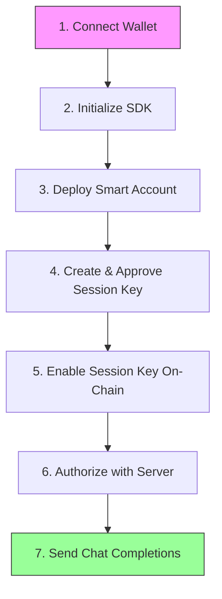

# Getting Started

This guide covers everything you need to go from installation to sending your first chat completion request with Router402.

## Prerequisites

- **Node.js 18+** or **Bun 1.0+**
- A **JWT token** from Router402 (obtained via `/v1/authorize`)
- For smart account features: a **Pimlico API key** ([pimlico.io](https://www.pimlico.io/)) and a wallet library like **Wagmi** or **Viem**

## Installation

```bash
npm install @router402/sdk viem
```

Or with Bun:

```bash
bun add @router402/sdk viem
```

## Configuration

For **chat-only** usage, just pass your JWT token:

```typescript
import { Router402Sdk } from "@router402/sdk";

const sdk = new Router402Sdk({
  token: process.env.ROUTER402_TOKEN!,
});
```

For **smart account** operations (deploy, session keys, gasless transactions), also provide `chain` and `pimlicoApiKey`:

```typescript
import { Router402Sdk } from "@router402/sdk";
import { baseSepolia } from "viem/chains";

const sdk = new Router402Sdk({
  chain: baseSepolia,
  pimlicoApiKey: process.env.PIMLICO_API_KEY!,
  token: process.env.ROUTER402_TOKEN!, // optional here, can set later via setToken()
});
```

### Configuration Options

| Option | Type | Required | Default | Description |
|--------|------|----------|---------|-------------|
| `token` | `string` | No | -- | JWT token for API auth (can also use `setToken()`) |
| `chain` | `Chain` | No* | -- | Target blockchain (from `viem/chains`) |
| `pimlicoApiKey` | `string` | No* | -- | Pimlico API key for bundler and paymaster |
| `apiBaseUrl` | `string` | No | `https://api.router402.xyz` | Router402 API base URL |
| `entryPointVersion` | `"0.7"` | No | `"0.7"` | ERC-4337 entry point version |
| `sessionKeyValidityPeriod` | `number` | No | `31536000` | Session key validity in seconds (1 year) |

\* Required only for smart account operations (deploy, session keys, transactions).

## Setup Flow

The complete setup flow from wallet connection to sending chat completions:



### Step 1: Create a Wallet Client

```typescript
// With Wagmi (React)
import { useWalletClient } from "wagmi";
const { data: walletClient } = useWalletClient();

// With Viem directly
import { createWalletClient, custom } from "viem";
import { baseSepolia } from "viem/chains";

const walletClient = createWalletClient({
  chain: baseSepolia,
  transport: custom(window.ethereum),
});
```

### Step 2: Setup Account (Deploy + Session Key)

The `setupAccount()` method handles deployment, session key generation, approval, and on-chain enablement in a single call:

```typescript
const USDC_BASE_SEPOLIA = "0x036CbD53842c5426634e7929541eC2318f3dCF7e";

const setup = await sdk.setupAccount(walletClient, eoaAddress, {
  usdcAddress: USDC_BASE_SEPOLIA,
  onStatus: (status) => {
    // "initializing" → "deploying" → "creating_session_key"
    // → "approving_session_key" → "enabling_session_key" → "complete"
    console.log("Setup status:", status);
  },
});

console.log("Smart Account:", setup.info.address);
console.log("Session Key:", setup.sessionKey.publicKey);
```

### Step 3: Authorize with Server

Sign an EIP-712 message and send the session key data to the Router402 server to receive a JWT token:

```typescript
import { signTypedData } from "viem/actions";

// Export session key for the server
const backendData = sdk.exportSessionKeyForBackend(setup.sessionKey);
const nonce = 0;

const requestBody = {
  smartAccountAddress: setup.info.address,
  privateKey: backendData.privateKey,
  serializedSessionKey: backendData.serializedSessionKey,
  eoaAddress,
  chainId: sdk.getChainId(),
  nonce,
};

// Sign the EIP-712 authorization message
const signature = await signTypedData(walletClient, {
  domain: {
    name: "Router402 Authorization",
    version: "1",
    chainId: BigInt(sdk.getChainId()),
  },
  types: {
    Authorization: [
      { name: "smartAccountAddress", type: "address" },
      { name: "privateKey", type: "string" },
      { name: "serializedSessionKey", type: "string" },
      { name: "eoaAddress", type: "address" },
      { name: "chainId", type: "uint256" },
      { name: "nonce", type: "uint256" },
    ],
  },
  primaryType: "Authorization",
  message: {
    ...requestBody,
    chainId: BigInt(sdk.getChainId()),
    nonce: BigInt(nonce),
  },
});

// Send to the server
const response = await fetch("https://api.router402.xyz/v1/authorize", {
  method: "POST",
  headers: {
    "Content-Type": "application/json",
    "x-authorization-signature": signature,
  },
  body: JSON.stringify(requestBody),
});

const { data } = await response.json();
const jwtToken = data.token;
```

### Step 4: Send Chat Completions

If you passed `token` in the constructor, you can call `chat()` directly. Otherwise, set it first:

```typescript
// If token wasn't in the constructor, set it now
sdk.setToken(jwtToken);

// Send a chat completion
const response = await sdk.chat("What is account abstraction?");
console.log(response);
```

### Chat Options

You can pass options to customize the request:

```typescript
const response = await sdk.chat("Explain ERC-4337", {
  model: "anthropic/claude-haiku-4.5",  // Default: "anthropic/claude-sonnet-4.5"
  temperature: 0.7,                     // Sampling temperature (0-2)
  max_tokens: 1024,                     // Maximum tokens to generate
});
```

### Supported Models

| Model | Provider |
|-------|----------|
| `anthropic/claude-opus-4.5` | Anthropic |
| `anthropic/claude-sonnet-4.5` | Anthropic |
| `anthropic/claude-haiku-4.5` | Anthropic |
| `google/gemini-3-pro-preview` | Google |
| `google/gemini-3-flash-preview` | Google |

## Complete Example

Putting it all together:

```typescript
import { Router402Sdk } from "@router402/sdk";
import { baseSepolia } from "viem/chains";
import { signTypedData } from "viem/actions";

const USDC_BASE_SEPOLIA = "0x036CbD53842c5426634e7929541eC2318f3dCF7e";

// Include chain and pimlicoApiKey for smart account operations
const sdk = new Router402Sdk({
  chain: baseSepolia,
  pimlicoApiKey: process.env.PIMLICO_API_KEY!,
});

async function onboard(walletClient, eoaAddress: string) {
  // 1. Setup account (deploy + session key)
  const setup = await sdk.setupAccount(walletClient, eoaAddress, {
    usdcAddress: USDC_BASE_SEPOLIA,
    onStatus: (s) => console.log("Status:", s),
  });

  // 2. Authorize with server (get JWT)
  const backendData = sdk.exportSessionKeyForBackend(setup.sessionKey);
  const signature = await signTypedData(walletClient, {
    domain: {
      name: "Router402 Authorization",
      version: "1",
      chainId: BigInt(sdk.getChainId()),
    },
    types: {
      Authorization: [
        { name: "smartAccountAddress", type: "address" },
        { name: "privateKey", type: "string" },
        { name: "serializedSessionKey", type: "string" },
        { name: "eoaAddress", type: "address" },
        { name: "chainId", type: "uint256" },
        { name: "nonce", type: "uint256" },
      ],
    },
    primaryType: "Authorization",
    message: {
      smartAccountAddress: setup.info.address,
      privateKey: backendData.privateKey,
      serializedSessionKey: backendData.serializedSessionKey,
      eoaAddress,
      chainId: BigInt(sdk.getChainId()),
      nonce: 0n,
    },
  });

  const authResponse = await fetch("https://api.router402.xyz/v1/authorize", {
    method: "POST",
    headers: {
      "Content-Type": "application/json",
      "x-authorization-signature": signature,
    },
    body: JSON.stringify({
      smartAccountAddress: setup.info.address,
      privateKey: backendData.privateKey,
      serializedSessionKey: backendData.serializedSessionKey,
      eoaAddress,
      chainId: sdk.getChainId(),
      nonce: 0,
    }),
  });

  const { data } = await authResponse.json();

  // 3. Set token and send chat completion
  sdk.setToken(data.token);
  const response = await sdk.chat("Hello, Router402!");
  console.log("Response:", response);
}
```

## Error Handling

The SDK throws `SmartAccountError` for domain-specific errors:

```typescript
import { SmartAccountError } from "@router402/sdk";

try {
  await sdk.setupAccount(walletClient, eoaAddress, { usdcAddress });
} catch (error) {
  if (error instanceof SmartAccountError) {
    switch (error.type) {
      case "USER_REJECTED":
        console.log("User cancelled the wallet signature");
        break;
      case "DEPLOYMENT_FAILED":
        console.log("Smart account deployment failed");
        break;
      case "NETWORK_ERROR":
        console.log("Network issue -- check RPC connection");
        break;
      default:
        console.error("Setup error:", error.message);
    }
  }
}
```

### Error Types

| Type | Description |
|------|-------------|
| `NOT_CONFIGURED` | SDK not properly configured |
| `DEPLOYMENT_FAILED` | Smart account deployment failed |
| `INSUFFICIENT_FUNDS` | Not enough funds for operation |
| `USER_REJECTED` | User rejected the wallet prompt |
| `NETWORK_ERROR` | Blockchain network error |
| `SESSION_KEY_NOT_APPROVED` | Session key has not been approved |
| `INVALID_SESSION_KEY` | Session key data is invalid |
| `SESSION_KEY_EXPIRED` | Session key has passed its expiration |
